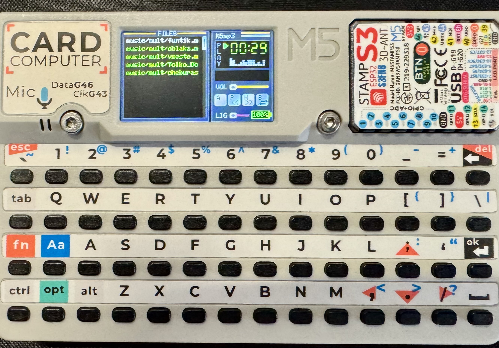
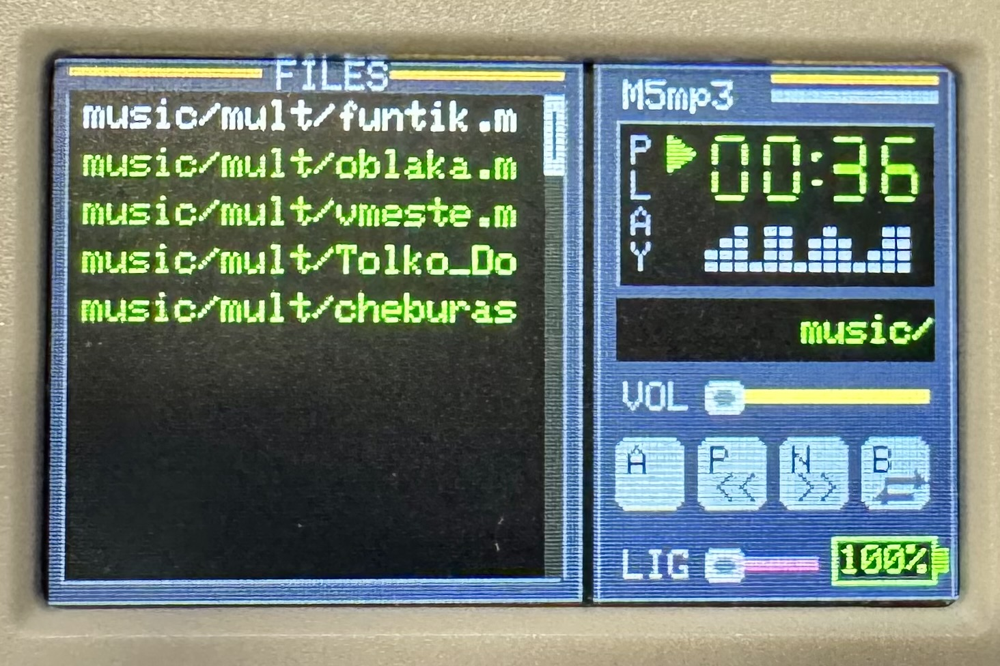
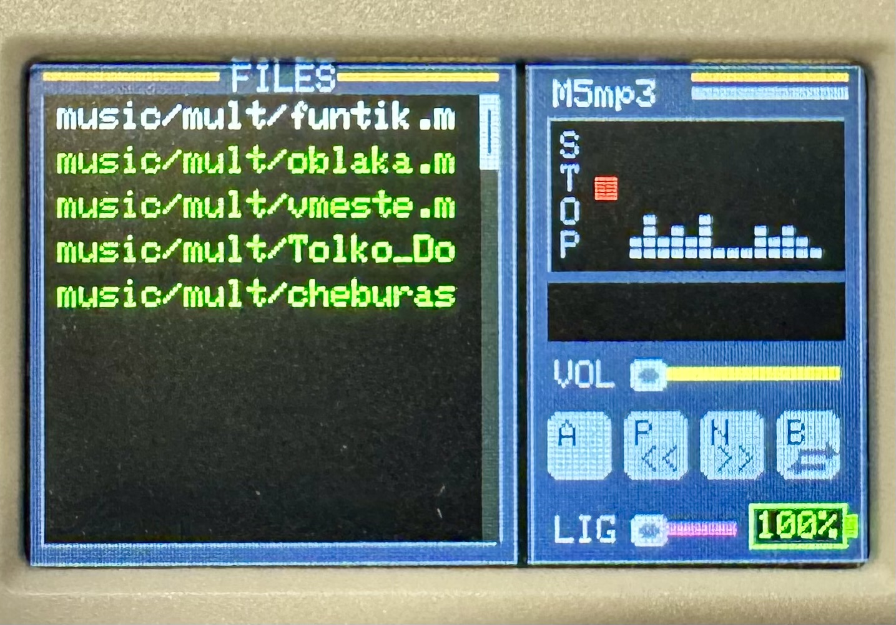

# M5mp3

Это приложение для [M5Stack Cardputer](https://docs.m5stack.com/en/core/Cardputer%20V1.1)

Плеер mp3 в стиле winamp. 

Основа взята из репозитория https://github.com/VolosR/M5Mp3/tree/main/M5mp3

После обновления библиотек в arduino ide проект или не собирался или сыпал ошибками после запуска.

Библиотека, которая помогает проигрывать звуковые файлы:

- https://github.com/schreibfaul1/ESP32-audioI2S version 3.0.13

Более новая версия не работает. Может автор пофиксит. 

Что поправил:

1. Увеличил лимит на количество файлов до 256 и до 3-х уровней сканирования поддриекторий.
2. Переместил сканирование из / в директорию /music
3. Поправил сканирование директории с музыкой. Сканирование в поддиректориях не работало
4. Рефакторинг переменных и форматирования

Файлы проигрываются из директории /music

Управление плеером:

- A - играть/стоп
- P - предыдущий трек
- N - следующий трек
- V - громкость
- L - яркость экрана

